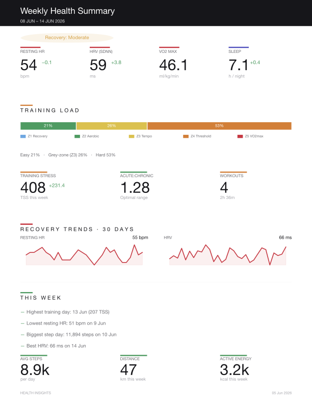

# Health Insights

Turns your Apple HealthKit export into the kind of weekly and monthly PDF reports a coach would write: training load, recovery readiness, sleep debt, and anomaly flags — computed locally, no cloud, no subscription.



*Generated entirely from the synthetic sample data in this repo — try it yourself below.*

## Why it exists

Apple Health collects an enormous amount of data and then shows you almost none of it usefully. Fitness platforms that do the analysis want your health data on their servers and £10 a month. This tool does the sports-science maths locally: you export from the Health app, import once, and get reports that answer the questions that matter — *am I training enough, recovering enough, and is anything quietly going wrong?*

## What it computes

| Metric | What it tells you |
|--------|-------------------|
| **TRIMP** (Banister's Training Impulse) | Workout strain weighted exponentially by heart-rate reserve — a hard 30 minutes scores more than an easy 60 |
| **TSS** (Training Stress Score) | TRIMP normalised so 1 hour at threshold = 100, comparable across weeks |
| **Acute:Chronic Workload Ratio** | 7-day vs 28-day rolling load. Above ~1.5 is injury-risk territory; below 0.8 is detraining |
| **Readiness score** (0–100) | HRV and resting-HR z-scores against your own rolling 30-day baseline — green/amber/red each morning |
| **Training monotony & strain** | Foster's method: same-load-every-day training is riskier than varied load |
| **Sleep debt** | Cumulative deficit against target, capped so one bad fortnight doesn't haunt you forever |
| **Anomaly detection** | Conservative flags only: resting HR >2 SD, HRV down >15% for 3 days, sleep efficiency <75% for 5 nights, VO₂ max declining |

Baselines are *personal* — the tool learns your normal ranges rather than comparing you to population tables (though population context is shown alongside).

## Try it without your own data

The repo ships a generator for six months of realistic synthetic data (a fictional recreational runner, complete with an illness week in March):

```bash
python3 -m venv venv && source venv/bin/activate
pip install -e .
python scripts/generate_sample_data.py
health-report weekly --data-dir sample_data --date 2026-06-14 --output sample-weekly.pdf
```

## Using your own data

1. iPhone → Health app → profile picture → **Export All Health Data** → AirDrop the zip to your Mac
2. ```bash
   cp config/settings.example.yaml config/settings.yaml   # personalise
   health-report import /path/to/export.xml
   health-report weekly
   health-report monthly
   ```

Your data never leaves your machine. The `data/`, `exports/` and `reports/` directories are gitignored.

## Commands

| Command | Description |
|---------|-------------|
| `health-report import <file>` | Parse a HealthKit export into clean CSVs (daily metrics, workouts, sleep) |
| `health-report weekly [--date YYYY-MM-DD] [--data-dir DIR]` | Single-page weekly summary PDF |
| `health-report monthly [--date YYYY-MM] [--data-dir DIR]` | Multi-page monthly deep-dive PDF |
| `health-report status` | Data file stats and recent reports |
| `health-report schedule-info` | cron/launchd snippets for automatic Monday-morning reports |

## Architecture

```
export.xml ──► parser.py ──► daily_metrics.csv / workouts.csv / sleep.csv
                                   │
                                   ▼
                  metrics.py + analytics.py   (pure functions, unit tested)
                  TRIMP · TSS · ACWR · readiness · baselines · anomalies
                                   │
                                   ▼
                  report_weekly.py / report_monthly.py ──► PDF
                  (matplotlib + a shared design system in report_style.py)
```

The calculation core is deliberately free of I/O and framework code — every formula in `src/metrics.py` and `src/analytics.py` is a pure function over DataFrames, covered by the test suite:

```bash
pip install pytest
pytest
```

## Configuration

`config/settings.yaml` (copy from `settings.example.yaml`) controls targets, HR zones (set your real max HR if you know it; otherwise Tanaka's 208 − 0.7×age estimate is used), baseline windows, and anomaly thresholds. The defaults are deliberately conservative — an anomaly flag should mean something.

## Stack

Python 3.11 · pandas · numpy · matplotlib · reportlab · click · pytest
